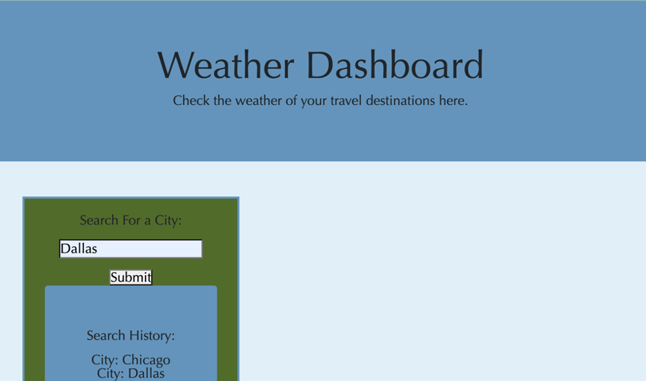
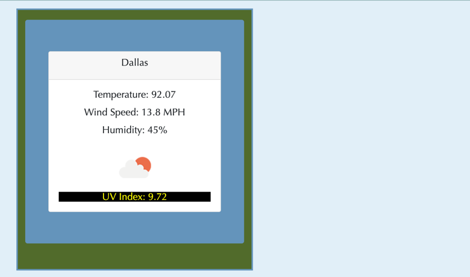

# Caitlin Stevenson|Weather Dashboard Assignment

## Objectives

In this project, I created a weather dashboard web application that allows a user to input a city into the weather search form and receive the current and five day weather forecast for that location.

## Tech Stack

HTML
CSS
JavaScript
Third Party API (Open Weather API)
Local Storage

## Installation

To launch this application locally begin by cloning the repo down from the GitHub Repo [weather_dashboard](https://github.com/caitlinscodes/weather_dashboard). Once cloned right click on the index.html and select "Open with Live Server".

## Screenshot of Final Page

## Link To The Final Page

[Link to final webpage](https://caitlinscodes.github.io/weather_dashboard/)

## Link to GitHub Repo

[Link to Repo](https://github.com/caitlinscodes/weather_dashboard)

## License

This code is licensed under the MIT License.